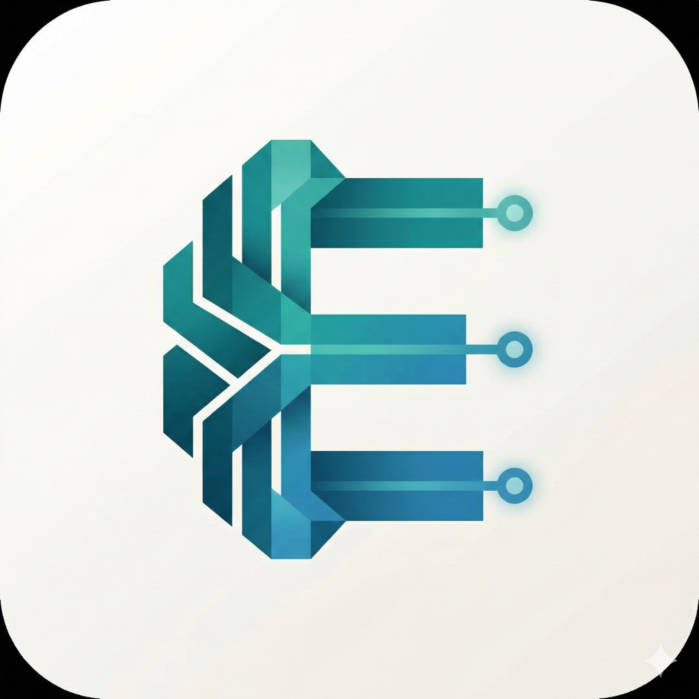
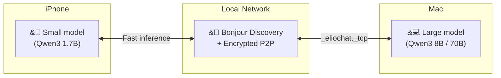

<p align="center">
  
</p>

<h1 align="center">ElioChat</h1>

<h3 align="center">Your secret-keeping second brain.</h3>

<p align="center">
  Completely free ・ No ads ・ Works offline ・ Zero data transmission
</p>

<p align="center">
  <a href="https://apps.apple.com/app/elio-chat/id6757635481">
    
  </a>
  &nbsp;&nbsp;
  <a href="https://elio.love">
    
  </a>
</p>

<br>

<p align="center">
  
  &nbsp;
  
  &nbsp;
  
  &nbsp;
  
  &nbsp;
  
</p>

<p align="center">
  <a href="README.md">日本語</a> ｜ <strong>English</strong>
</p>

<br>

---

<br>

<p align="center">
  
  &nbsp;
  
  &nbsp;
  
  &nbsp;
  
  &nbsp;
  
</p>

<br>

---

<br>

## What Can ElioChat Do?

<br>

<table>
<tr>
<td width="50%" valign="top">

### &#9992;&#65039; Chat with AI in Airplane Mode

No internet needed. Works on planes, subways, and anywhere offline.
All processing runs on your iPhone. No data ever leaves your device.

> **You**: Summarize today's meeting notes
>
> **Elio**: Sure. Here's a summary:
> - Date: Feb 23, 14:00-15:00
> - Attendees: Tanaka, Sato, Yamada
> - Agenda: Q1 sales report...

</td>
<td width="50%" valign="top">

### &#128197; Control Calendar & Reminders with AI

Directly integrates with iOS Calendar, Reminders, Contacts, and Photos.
First iOS app to support [MCP](https://modelcontextprotocol.io/).

> **You**: What's on my schedule today?
>
> **Elio**: I checked your calendar:
> - 10:00 Team Meeting
> - 12:00 Lunch with Sarah
> - 14:00 Project Review

</td>
</tr>
<tr>
<td width="50%" valign="top">

### &#127912; Ask AI About Your Photos

Analyze camera photos or library images instantly.
Powered by Qwen3-VL / SmolVLM vision models.

> **You**: &#91;attach photo&#93; What flower is this?
>
> **Elio**: This is a cherry blossom (Sakura).
> It typically blooms from late March to early April.

</td>
<td width="50%" valign="top">

### &#127908; Voice Input

On-device speech recognition with WhisperKit.
Japanese & English. Voice data never leaves your device.

> **You**: &#91;tap microphone&#93;
>
> "Remind me about the dentist at 9am tomorrow"
>
> **Elio**: Reminder created:
> Dentist - Tomorrow 9:00

</td>
</tr>
</table>

<br>

---

<br>

## &#128640; ElioChat vs ChatGPT

<table>
<thead>
<tr>
<th align="left"></th>
<th align="center">ElioChat</th>
<th align="center">ChatGPT</th>
</tr>
</thead>
<tbody>
<tr><td><strong>&#128504; Offline</strong></td><td align="center">Airplane Mode OK</td><td align="center">Internet required</td></tr>
<tr><td><strong>&#128274; Data Transmission</strong></td><td align="center">Zero</td><td align="center">Sent to cloud</td></tr>
<tr><td><strong>&#128065; Used for AI Training</strong></td><td align="center">Never</td><td align="center">May be used</td></tr>
<tr><td><strong>&#127970; Enterprise Use</strong></td><td align="center">OK even if ChatGPT banned</td><td align="center">Policy dependent</td></tr>
<tr><td><strong>&#128190; Data Storage</strong></td><td align="center">Device only</td><td align="center">On servers</td></tr>
<tr><td><strong>&#128279; MCP Integration</strong></td><td align="center">13 types</td><td align="center">Not supported</td></tr>
<tr><td><strong>&#128421; P2P Inference</strong></td><td align="center">Mac collaboration</td><td align="center">Not supported</td></tr>
<tr><td><strong>&#128176; Price</strong></td><td align="center"><strong>Completely free</strong></td><td align="center">$20/month</td></tr>
</tbody>
</table>

<br>

---

<br>

## &#129302; 30+ AI Models

<table>
<tr>
<td width="33%" valign="top">

#### &#11088; Recommended

| Model | Size |
|-------|------|
| Qwen3 0.6B | ~500MB |
| Qwen3 1.7B | ~1.2GB |
| Qwen3 4B | ~2.7GB |
| Qwen3 8B | ~5GB |
| Gemma 3 1B | ~700MB |
| Gemma 3 4B | ~2.5GB |
| Phi-4 Mini | ~2.4GB |

</td>
<td width="33%" valign="top">

#### &#127471;&#127477; Japanese Optimized

| Model | Size |
|-------|------|
| TinySwallow 1.5B | ~986MB |
| ELYZA Llama 3 8B | ~5.2GB |
| Swallow 8B | ~5.2GB |

> By Sakana AI, UTokyo Matsuo Lab, and Tokyo Tech

</td>
<td width="33%" valign="top">

#### &#128248; Vision

| Model | Size |
|-------|------|
| Qwen3-VL 2B | ~1.1GB |
| Qwen3-VL 4B | ~2.5GB |
| Qwen3-VL 8B | ~5GB |
| SmolVLM 2B | ~1.1GB |

> Just attach a photo and AI analyzes it

</td>
</tr>
</table>

<br>

---

<br>

## &#128421; P2P Inference ― iPhone + Mac

Offload heavy inference to your Mac over local network. Data stays on LAN.



<table>
<tr>
<td width="50%" valign="top">

**&#128268; How it works**

1. Load a model on Mac
2. Mac advertises via `_eliochat._tcp`
3. iPhone discovers Mac via Bonjour
4. Secure pairing with 4-digit code
5. Auto-reconnect on next launch

</td>
<td width="50%" valign="top">

**&#9889; Chat Modes**

| Mode | Description |
|------|-------------|
| **Local** | On-device only (fully offline) |
| **Cloud** | ChatWeb API / Groq |
| **Private P2P** | Use Mac's power |
| **P2P Mesh** | Multi-device inference |
| **Speculative** | Local draft + Mac verify |

</td>
</tr>
</table>

<br>

---

<br>

<details>
<summary><h2>&#128736;&#65039; For Developers</h2></summary>

### Build

```bash
git clone https://github.com/yukihamada/elio.git
cd elio
open ElioChat.xcodeproj
```

1. Configure Signing & Capabilities
2. Connect device and `Cmd+R`

### Test

```bash
# 135 unit tests
xcodebuild test -project ElioChat.xcodeproj -scheme ElioChat \
  -testPlan UnitTests -destination 'platform=iOS Simulator,name=iPhone 16'
```

### Architecture

```mermaid
graph TB
    subgraph Views["&#127912; Views (SwiftUI)"]
        V1[ChatView]
        V2[SettingsView]
        V3[PeerConnectionView]
    end

    subgraph App["&#128241; App Layer"]
        A1[AppState]
        A2[AppIntents / Siri]
    end

    subgraph Agent["&#129302; Agent"]
        AG1[AgentOrchestrator]
        AG2[ConversationManager]
        AG3[ToolParser]
    end

    subgraph ChatModes["&#128260; ChatModes"]
        CM[ChatModeManager]
        B1[LocalBackend]
        B2[CloudBackend]
        B3[P2PBackend]
        B4[SpeculativeBackend]
    end

    subgraph LLM["&#9881;&#65039; LLM Engine"]
        L1["ModelLoader<br>(30+ GGUF models)"]
        L2["CoreMLInference<br>(llama.cpp)"]
        L3["WhisperManager<br>(WhisperKit)"]
    end

    subgraph MCP["&#128279; MCP Servers"]
        M1["Calendar / Reminders"]
        M2["Contacts / Photos"]
        M3["Location / Web Search"]
    end

    subgraph P2P["&#128421; P2P Server"]
        P1[PrivateServerManager]
        P2[MeshP2PManager]
        P3["ProximityDiscovery<br>(Bonjour)"]
    end

    Views --> App --> Agent --> ChatModes
    ChatModes --> LLM
    Agent --> MCP
    ChatModes --> P2P
```



### Contributing

PRs welcome! Fork → branch → commit → push → PR.

</details>

<br>

---

<br>

<p align="center">
  <a href="https://apps.apple.com/app/elio-chat/id6757635481">
    
  </a>
</p>

<p align="center">
  <a href="https://elio.love">Website</a> ・
  <a href="https://elio.love/privacy">Privacy Policy</a> ・
  <a href="https://elio.love/terms">Terms of Service</a> ・
  <a href="LICENSE">MIT License</a>
</p>

<br>

<p align="center">

**Credits**: [llama.cpp](https://github.com/ggerganov/llama.cpp) ・ [Model Context Protocol](https://modelcontextprotocol.io/) ・ [WhisperKit](https://github.com/argmaxinc/WhisperKit)

</p>

<p align="center">
  <sub>Made with love by <a href="https://github.com/yukihamada">yukihamada</a></sub>
</p>
