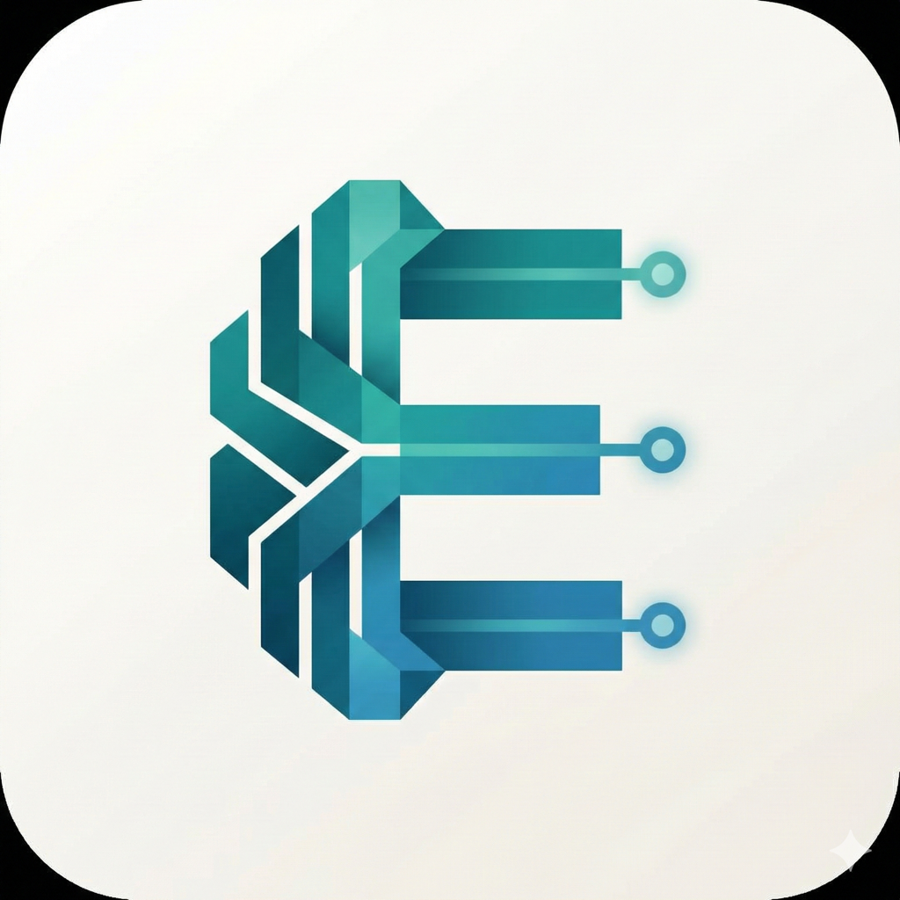

<p align="center">
  
</p>

<h1 align="center">ElioChat</h1>

<p align="center">
  <strong>あなたの秘密を守る、第2の脳</strong>
</p>

<p align="center">
  <a href="https://elio.love">ウェブサイト</a> •
  <a href="#features">機能</a> •
  <a href="#installation">インストール</a> •
  <a href="#supported-models">モデル</a> •
  <a href="#mcp-integration">MCP</a> •
  <a href="#privacy">プライバシー</a> •
  <a href="#license">ライセンス</a>
</p>

<p align="center">
  
  
  
  
</p>

<p align="center">
  <strong>日本語</strong> | <a href="README.md">English</a>
</p>

---

## 概要

**ElioChat**は、iPhone上で完全にローカル動作するAIアシスタントアプリです。インターネット接続不要で、プライバシーを完全に保護しながら、カレンダー、リマインダー、連絡先、写真などiOSの機能と連携できます。

### なぜElioChat？ - ChatGPTより安心

| | ElioChat | ChatGPT |
|-----|------|---------|
| **オフライン動作** | 機内モードでもOK | インターネット必須 |
| **データ送信** | ゼロ（完全ローカル） | クラウドに送信 |
| **AI学習への使用** | 使用されない | 学習に使用される可能性 |
| **企業での利用** | 社内規定でChatGPT禁止でもOK | 利用規定による |
| **プライバシー** | 会話は端末内のみ | サーバーに保存 |

- **MCP対応** - Model Context Protocolでシステム機能と連携
- **30以上のモデル** - Qwen3、Gemma 3、Phi-4、Llama 3.2など
- **Vision AI** - Qwen3-VLによる画像認識
- **音声入力** - WhisperKitによるオンデバイス音声認識
- **日本語対応** - UIとAI応答の両方で日本語をサポート

---

## 機能

### ローカルLLM推論

| カテゴリ | モデル | サイズ |
|----------|--------|--------|
| **おすすめ** | Qwen3 (0.6B-8B), Gemma 3 (1B-4B), Phi-4 Mini | 500MB-5GB |
| **日本語特化** | TinySwallow 1.5B, ELYZA Llama 3 8B, Swallow 8B | 1GB-5.2GB |
| **画像認識** | Qwen3-VL (2B-8B), SmolVLM 2B | 1.1GB-5GB |
| **高効率** | LFM2 (350M-1.2B), Jan Nano (128K/1M) | 350MB-731MB |

- llama.cpp による高速推論（GGUF形式）
- ダウンロード進捗・速度・残り時間をリアルタイム表示
- デバイスに最適なモデルを自動推奨

### MCP (Model Context Protocol) 連携

ElioChatは以下のiOS機能とAIを連携させます：

| サーバー | 機能 |
|----------|------|
| カレンダー | 予定の確認・作成・削除 |
| リマインダー | リマインダーの管理 |
| 連絡先 | 連絡先の検索・表示 |
| 位置情報 | 現在地の取得 |
| 写真 | 写真ライブラリへのアクセス |
| ファイル | ドキュメントの読み書き |
| Web検索 | DuckDuckGo匿名検索 |

### Vision（画像認識）

- 画像を添付してAIに質問可能
- カメラで撮影した写真をその場で分析
- Qwen3-VL（2B/4B/8B）、SmolVLMをサポート
- Visionモデルの自動ダウンロード提案

### 音声入力

- WhisperKitによるオンデバイス音声認識
- 日本語・英語対応
- ダウンロード進捗表示
- 一度ダウンロードしたモデルはキャッシュ保存

### UI/UX

- ダーク/ライトモード対応
- スワイプで操作できるオンボーディング
- リアルタイムストリーミング表示
- 会話履歴の保存・管理
- **会話検索機能** - 過去の会話をすぐに見つける
- **シェアカード** - SNS用の美しい会話画像を作成
- **会話エクスポート** - テキストやJSON形式で保存

### Siriショートカット

音声でElioChatを操作：
- 「Hey Siri、ElioChatに聞いて」- 会話を開始
- 「Hey Siri、ElioChatで予定を確認」- カレンダーを見る
- 「Hey Siri、ElioChatでリマインダー作成」- リマインダー追加

### 紹介プログラム

友達にElioChatをシェア：
- あなた専用の紹介コードを生成
- ワンタップでシェア
- 紹介した人数を確認

---

## インストール

### 必要要件

- iOS 17.0以上
- iPhone または iPad（arm64）
- Xcode 15.0以上

### ビルド手順

```bash
# リポジトリをクローン
git clone https://github.com/yukihamada/LocalAIAgent.git
cd LocalAIAgent

# Xcodeで開く
open ElioChat.xcodeproj
```

1. Xcode で Signing & Capabilities を設定
2. 実機を接続して Run (Cmd+R)

### モデルのダウンロード

初回起動時に以下のダウンロードガイドが表示されます：
- **テキストモデル** - Qwen3 1.7B（ほとんどのデバイスに推奨）
- **画像認識モデル** - Qwen3-VL 2B（オプション）

追加モデルは設定画面からダウンロードできます。

---

## 対応モデル

ElioChatは30以上のGGUF形式モデルに対応しています。

### おすすめ
| モデル | サイズ | 特徴 |
|--------|--------|------|
| Qwen3 0.6B | ~500MB | 全デバイス、超高速 |
| Qwen3 1.7B | ~1.2GB | 全デバイス、バランス良好 |
| Qwen3 4B | ~2.7GB | Pro以上、高性能 |
| Qwen3 8B | ~5GB | Pro Max、最高品質 |
| Gemma 3 1B | ~700MB | 全デバイス、Google最新 |
| Gemma 3 4B | ~2.5GB | Pro以上、優秀 |
| Phi-4 Mini | ~2.4GB | Pro以上、推論最強 |

### 日本語特化
| モデル | サイズ | 備考 |
|--------|--------|------|
| TinySwallow 1.5B | ~986MB | Sakana AI製、高品質 |
| ELYZA Llama 3 8B | ~5.2GB | 東大松尾研、最高峰 |
| Swallow 8B | ~5.2GB | 東工大、ビジネス文書 |

### 画像認識モデル
| モデル | サイズ | 備考 |
|--------|--------|------|
| Qwen3-VL 2B | ~1.1GB | 全デバイス |
| Qwen3-VL 4B | ~2.5GB | Pro以上 |
| Qwen3-VL 8B | ~5GB | Pro Max、最高品質 |

### 高効率・長コンテキスト
| モデル | サイズ | コンテキスト |
|--------|--------|--------------|
| LFM2 350M | ~350MB | 32K |
| LFM2 1.2B | ~731MB | 32K |
| Jan Nano 128K | ~500MB | 128Kトークン |
| Jan Nano 1M | ~500MB | 1Mトークン |

---

## MCP連携

ElioChatはAnthropicの[Model Context Protocol](https://modelcontextprotocol.io/)を採用し、AIとiOSシステム機能をシームレスに連携させます。

### 使用例

```
ユーザー: 今日の予定を教えて

ElioChat: カレンダーを確認しました。今日の予定は以下の通りです：
• 10:00 - 11:30 週次デザイン定例
• 13:00 - 14:00 ランチミーティング w/ 佐藤さん
• 16:00 - 17:30 プロジェクトX 進捗報告会
```

```
ユーザー: 明日の午前10時に「歯医者」のリマインダーを作成して

ElioChat: リマインダーを作成しました：
  歯医者
  明日 10:00
```

---

## プライバシー

ElioChatはプライバシーファーストで設計されています。

- **すべての処理が端末上で完結**
- **外部サーバーへのデータ送信なし**
- **会話履歴は端末内にのみ保存**
- **オープンソース** - コードを確認可能

### 必要な権限

| 権限 | 用途 |
|------|------|
| カレンダー | 予定の読み書き |
| リマインダー | リマインダーの管理 |
| 連絡先 | 連絡先の検索 |
| 位置情報 | 現在地の取得 |
| 写真 | 画像の読み込み・保存 |
| マイク | 音声入力 |

すべての権限は必要に応じてユーザーに許可を求めます。

---

## アーキテクチャ

```
LocalAIAgent/
├── App/                    # アプリケーション層
│   ├── LocalAIAgentApp.swift
│   ├── AppState.swift      # 状態管理
│   └── AppIntents.swift    # Siriショートカット
├── Agent/                  # AIエージェント
│   ├── AgentOrchestrator.swift
│   ├── ConversationManager.swift
│   └── ToolParser.swift
├── LLM/                    # 推論エンジン
│   ├── ModelLoader.swift   # モデル管理・ダウンロード
│   ├── CoreMLInference.swift
│   ├── WhisperManager.swift # 音声認識
│   └── Tokenizer.swift
├── MCP/                    # MCPプロトコル
│   ├── MCPClient.swift
│   ├── MCPProtocol.swift
│   └── Servers/           # MCPサーバー実装
├── Services/              # ビジネスロジック
│   ├── ConversationExporter.swift
│   └── ReferralManager.swift
├── Views/                  # SwiftUI画面
└── Resources/              # アセット・ローカライズ
```

---

## コントリビュート

プルリクエストを歓迎します！

1. このリポジトリをフォーク
2. フィーチャーブランチを作成 (`git checkout -b feature/amazing-feature`)
3. 変更をコミット (`git commit -m 'Add amazing feature'`)
4. ブランチをプッシュ (`git push origin feature/amazing-feature`)
5. プルリクエストを作成

---

## ライセンス

MIT License - 詳細は [LICENSE](LICENSE) を参照してください。

---

## 謝辞

- [llama.cpp](https://github.com/ggerganov/llama.cpp) - GGUF推論エンジン
- [Model Context Protocol](https://modelcontextprotocol.io/) - AI連携プロトコル
- [WhisperKit](https://github.com/argmaxinc/WhisperKit) - オンデバイス音声認識

---

<p align="center">
  Made with love by <a href="https://github.com/yukihamada">yukihamada</a>
</p>
