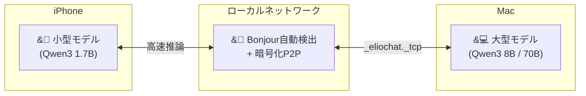

<p align="center">
  
</p>

<h1 align="center">ElioChat</h1>

<h3 align="center">あなたの秘密を守る、第2の脳。</h3>

<p align="center">
  完全無料 ・ 広告なし ・ オフライン動作 ・ データ送信ゼロ
</p>

<p align="center">
  <a href="https://apps.apple.com/app/elio-chat/id6757635481">
    
  </a>
  &nbsp;
  <a href="https://apps.apple.com/app/elio-chat/id6757635481">
    
  </a>
  &nbsp;
  <a href="https://elio.love">
    
  </a>
</p>

<br>

<p align="center">
  
  &nbsp;
  
  &nbsp;
  
  &nbsp;
  
  &nbsp;
  
  &nbsp;
  
</p>

<p align="center">
  <strong>日本語</strong> ｜ <a href="README.en.md">English</a>
</p>

<br>

---

<br>

<p align="center">
  
  &nbsp;
  
  &nbsp;
  
  &nbsp;
  
  &nbsp;
  
</p>

<br>

---

<br>

## ElioChatでできること

<br>

<table>
<tr>
<td width="50%" valign="top">

### &#9992;&#65039; 機内モードでもAIと会話

インターネット不要。飛行機・地下鉄・山の中でも動きます。
すべての処理がiPhone上で完結し、データが外部に漏れることはありません。

> **あなた**: 今日の会議の議事録をまとめて
>
> **Elio**: 承知しました。以下の形式でまとめます：
> - 日時: 2月23日 14:00-15:00
> - 参加者: 田中、佐藤、山田
> - 議題: Q1売上報告...

</td>
<td width="50%" valign="top">

### &#128197; カレンダー・リマインダーをAIで操作

iOS標準のカレンダー・リマインダー・連絡先・写真と直接連携。
[MCP](https://modelcontextprotocol.io/) 対応 **世界初** のiOSアプリです。

> **あなた**: 今日の予定を教えて
>
> **Elio**: カレンダーを確認しました：
> - 10:00 チーム定例
> - 12:00 佐藤さんとランチ
> - 14:00 プロジェクトレビュー

</td>
</tr>
<tr>
<td width="50%" valign="top">

### &#127912; 写真をAIに見せて質問

カメラで撮影した写真やライブラリの画像をその場で分析。
Qwen3-VL / SmolVLM による画像認識AIを搭載。

> **あなた**: &#91;写真を添付&#93; これは何の花？
>
> **Elio**: これはソメイヨシノ（桜）です。
> 開花時期は3月下旬〜4月上旬で、日本を代表する花です。

</td>
<td width="50%" valign="top">

### &#127908; 音声で入力

WhisperKit によるオンデバイス音声認識。
日本語・英語対応。音声データも外部送信なし。

> **あなた**: &#91;マイクボタンを押して話す&#93;
>
> 「明日の朝9時に歯医者のリマインダー作って」
>
> **Elio**: リマインダーを作成しました：
> 歯医者 - 明日 9:00

</td>
</tr>
</table>

<br>

---

<br>

## &#127775; もっとできること

<br>

<table>
<tr>
<td width="33%" valign="top">

### &#127760; リアルタイム通訳

**19言語対応のAI同時通訳。**

話しかけるだけで自動翻訳・自動読み上げ。
海外旅行・ビジネス・外国人との会話に。

> 日本語 &#8644; 英語 / 中国語 / 韓国語 / フランス語 / スペイン語 / ドイツ語 / アラビア語 / ヒンディー語 / タイ語 / ベトナム語 / トルコ語 / ポルトガル語 / ロシア語 / イタリア語 ...

&#128172; 話す → &#128221; 文字起こし → &#128301; 翻訳 → &#128266; 読み上げ

</td>
<td width="33%" valign="top">

### &#128274; デジタル金庫

**AES-256暗号化 + 生体認証。**

パスポート・保険証・銀行カード・重要書類を
軍事レベルの暗号化で端末内に安全に保管。

- Face ID / Touch ID でロック解除
- 5分で自動ロック
- 写真のOCRテキスト抽出
- PDFエクスポート対応
- マスターキーはKeychain保管

</td>
<td width="33%" valign="top">

### &#128506; オフライン防災マップ

**避難所データベース内蔵。**

地震・津波・台風・洪水・火災・土砂災害に対応した
避難所をオフラインで検索。

- 現在地から最寄りの避難所を表示
- 徒歩ルート案内
- 収容人数・設備情報
- バリアフリー・ペット可フィルター
- オフライン地図タイル対応

</td>
</tr>
<tr>
<td width="33%" valign="top">

### &#128172; P2Pメッセージング

**サーバーを経由しないDM。**

友達とローカルネットワークで直接メッセージ。
既読・配信確認付き。

- ペアリングコードで友達追加
- オンライン/オフライン状態表示
- オフライン時のメッセージキュー
- 友達リスト管理

</td>
<td width="33%" valign="top">

### &#128218; 緊急時ナレッジベース

**オフライン百科事典。**

12言語の緊急情報をAES暗号化で端末にキャッシュ。
圏外でも全文検索（FTS5）で瞬時に情報取得。

- 応急処置
- 災害対応マニュアル
- サバイバルガイド
- 自動更新検知

</td>
<td width="33%" valign="top">

### &#127918; ミニゲーム

**AIと遊べるオフラインゲーム。**

気分転換にどうぞ。

- &#9824;&#65039; ソリティア - 本格カードゲーム
- &#129504; 神経衰弱 - 8ペアマッチング
- &#128290; 15パズル - スライドパズル
- &#10060; 三目並べ - AI対戦

</td>
</tr>
<tr>
<td width="33%" valign="top">

### &#128176; トークンエコノミー

**P2P推論を提供してトークン獲得。**

Macでモデルを動かし、他のユーザーの推論リクエストを
処理するとトークンが貯まります。

- 初期: 100トークン無料
- 推論1回提供で1トークン獲得
- 週間統計・取引履歴

</td>
<td width="33%" valign="top">

### &#128722; スキルマーケット

**カスタムスキルのダウンロード＆公開。**

コミュニティが作ったスキルをインストールして
AIの能力を拡張。自分のスキルも公開可能。

- カテゴリ・人気・評価でフィルター
- キュレーターランク制度
- OGファウンダー認証

</td>
<td width="33%" valign="top">

### &#128257; 物々交換ボード

**AIマッチングの交換掲示板。**

「持っているもの」「欲しいもの」を投稿すると
AIが最適なマッチングを提案。

- 信頼スコアシステム
- P2Pメッシュで自動ブロードキャスト
- 取引履歴・評価

</td>
</tr>
</table>

<br>

---

<br>

## &#128640; ChatGPTとの比較

<table>
<thead>
<tr>
<th align="left"></th>
<th align="center">ElioChat</th>
<th align="center">ChatGPT</th>
</tr>
</thead>
<tbody>
<tr><td><strong>&#128504; オフライン動作</strong></td><td align="center">機内モードOK</td><td align="center">ネット必須</td></tr>
<tr><td><strong>&#128274; データ送信</strong></td><td align="center">ゼロ</td><td align="center">クラウドに送信</td></tr>
<tr><td><strong>&#128065; AI学習に使用</strong></td><td align="center">されない</td><td align="center">される可能性あり</td></tr>
<tr><td><strong>&#127970; 企業利用</strong></td><td align="center">ChatGPT禁止企業でもOK</td><td align="center">規定による</td></tr>
<tr><td><strong>&#128190; 会話の保存先</strong></td><td align="center">端末内のみ</td><td align="center">サーバーに保存</td></tr>
<tr><td><strong>&#128279; MCP連携</strong></td><td align="center">13種類</td><td align="center">非対応</td></tr>
<tr><td><strong>&#128421; P2P推論</strong></td><td align="center">Mac連携可能</td><td align="center">非対応</td></tr>
<tr><td><strong>&#127760; リアルタイム通訳</strong></td><td align="center">19言語</td><td align="center">非対応</td></tr>
<tr><td><strong>&#128274; 暗号化金庫</strong></td><td align="center">AES-256 + Face ID</td><td align="center">非対応</td></tr>
<tr><td><strong>&#128506; 防災マップ</strong></td><td align="center">オフライン避難所検索</td><td align="center">非対応</td></tr>
<tr><td><strong>&#128176; 料金</strong></td><td align="center"><strong>完全無料</strong></td><td align="center">月額 $20</td></tr>
</tbody>
</table>

<br>

---

<br>

## &#129302; 30以上のAIモデルから選択

<table>
<tr>
<td width="33%" valign="top">

#### &#11088; おすすめ

| モデル | サイズ |
|--------|--------|
| Qwen3 0.6B | ~500MB |
| Qwen3 1.7B | ~1.2GB |
| Qwen3 4B | ~2.7GB |
| Qwen3 8B | ~5GB |
| Gemma 3 1B | ~700MB |
| Gemma 3 4B | ~2.5GB |
| Phi-4 Mini | ~2.4GB |

</td>
<td width="33%" valign="top">

#### &#127471;&#127477; 日本語特化

| モデル | サイズ |
|--------|--------|
| TinySwallow 1.5B | ~986MB |
| ELYZA Llama 3 8B | ~5.2GB |
| Swallow 8B | ~5.2GB |

> Sakana AI、東大松尾研、東工大 による日本語最適化モデル

</td>
<td width="33%" valign="top">

#### &#128248; 画像認識 (Vision)

| モデル | サイズ |
|--------|--------|
| Qwen3-VL 2B | ~1.1GB |
| Qwen3-VL 4B | ~2.5GB |
| Qwen3-VL 8B | ~5GB |
| SmolVLM 2B | ~1.1GB |

> 写真を添付するだけでAIが画像を分析

</td>
</tr>
</table>

### デバイス別おすすめ

```
iPhone 12 / 13        →  Qwen3 0.6B - 1.7B （軽量・高速）
iPhone 14 Pro 以降     →  Qwen3 4B, Gemma 3 4B （高性能）
iPhone 15/16 Pro Max  →  Qwen3 8B, ELYZA 8B （最高品質）
Mac (Apple Silicon)   →  全モデル対応 + P2P推論サーバー
```

<br>

---

<br>

## &#128279; MCP連携 ― AIがiOSの機能を操作

[Model Context Protocol](https://modelcontextprotocol.io/) でAIとiOSシステム機能をシームレスに連携：

<table>
<tr>
<td width="33%" valign="top">

**&#128197; カレンダー**
- 予定の確認・作成・削除
- 「今日の予定を教えて」

**&#128221; リマインダー**
- リマインダーの管理
- 「明日10時にゴミ出し」

</td>
<td width="33%" valign="top">

**&#128100; 連絡先**
- 連絡先の検索・表示
- 「鈴木さんの電話番号は？」

**&#128205; 位置情報**
- 現在地の取得
- 「今の場所はどこ？」

</td>
<td width="33%" valign="top">

**&#128247; 写真**
- ライブラリへのアクセス
- 画像をAIに送信して分析

**&#128269; Web検索**
- DuckDuckGo匿名検索
- 「最新のiPhone価格は？」

</td>
</tr>
</table>

<br>

---

<br>

## &#128421; P2P推論 ― iPhone + Mac が連携

重い推論をMacにオフロード。データはLAN内のみで完結。



<table>
<tr>
<td width="50%" valign="top">

**&#128268; 接続方法**

1. Macでモデルをロード（サーバーダッシュボードで管理）
2. Mac が `_eliochat._tcp` でアドバタイズ開始
3. iPhoneがBonjourでMacを自動発見
4. 4桁コードでセキュアにペアリング
5. 次回以降は自動接続

</td>
<td width="50%" valign="top">

**&#9889; チャットモード**

| モード | 説明 |
|--------|------|
| **Local** | 端末のみ（完全オフライン） |
| **Cloud** | ChatWeb API / Groq |
| **Private P2P** | Macの推論パワーを活用 |
| **P2P Mesh** | 複数デバイスで協調推論 |
| **Speculative** | ローカル下書き + Mac検証 |

</td>
</tr>
</table>

> **Mac版の特別機能**: サーバーダッシュボードで接続クライアント数・リクエスト処理数・トークン収益をリアルタイム監視

<br>

---

<br>

## &#128100; こんな人におすすめ

<table>
<tr>
<td align="center" width="20%">
<br>
<strong>&#127970;</strong>
<br><br>
<strong>企業の機密情報を<br>扱う人</strong>
<br>
<sub>ChatGPT禁止の<br>企業でもOK</sub>
<br><br>
</td>
<td align="center" width="20%">
<br>
<strong>&#9992;&#65039;</strong>
<br><br>
<strong>圏外環境で<br>AIを使いたい人</strong>
<br>
<sub>飛行機・地下鉄<br>山の中でも</sub>
<br><br>
</td>
<td align="center" width="20%">
<br>
<strong>&#128274;</strong>
<br><br>
<strong>プライバシーを<br>重視する人</strong>
<br>
<sub>データ送信ゼロ<br>端末内で完結</sub>
<br><br>
</td>
<td align="center" width="20%">
<br>
<strong>&#127760;</strong>
<br><br>
<strong>海外旅行で<br>通訳が必要な人</strong>
<br>
<sub>19言語リアルタイム<br>通訳機能</sub>
<br><br>
</td>
<td align="center" width="20%">
<br>
<strong>&#128506;</strong>
<br><br>
<strong>災害への備えを<br>したい人</strong>
<br>
<sub>オフライン避難所<br>防災ナレッジ</sub>
<br><br>
</td>
</tr>
</table>

<br>

---

<br>

## &#128241; 動作環境

| プラットフォーム | 要件 | 推奨モデル |
|:---|:---|:---|
| **iPhone** | iOS 17.0+ | Qwen3 0.6B - 8B |
| **iPad** | iPadOS 17.0+ | 全モデル対応 |
| **Mac** | macOS 14.0+ (Apple Silicon) | 全モデル + P2Pサーバー |

<br>

---

<br>

<details>
<summary><h2>&#128736;&#65039; 開発者向け情報</h2></summary>

<br>

### ビルド

```bash
git clone https://github.com/yukihamada/elio.git
cd elio
open ElioChat.xcodeproj
```

1. Xcode で Signing & Capabilities を設定
2. 実機を接続して `Cmd+R`

### テスト

```bash
# 135件のユニットテスト
xcodebuild test -project ElioChat.xcodeproj -scheme ElioChat \
  -testPlan UnitTests -destination 'platform=iOS Simulator,name=iPhone 16'
```

### アーキテクチャ

```mermaid
graph TB
    subgraph Views["&#127912; Views (SwiftUI)"]
        V1[ChatView]
        V2[SettingsView]
        V3[PeerConnectionView]
        V4[ServerDashboardView &#128187;]
    end

    subgraph App["&#128241; App Layer"]
        A1[AppState]
        A2[AppIntents / Siri]
    end

    subgraph Agent["&#129302; Agent"]
        AG1[AgentOrchestrator]
        AG2[ConversationManager]
        AG3[ToolParser]
    end

    subgraph ChatModes["&#128260; ChatModes"]
        CM[ChatModeManager]
        B1[LocalBackend]
        B2[CloudBackend]
        B3[P2PBackend]
        B4[SpeculativeBackend]
    end

    subgraph LLM["&#9881;&#65039; LLM Engine"]
        L1["ModelLoader (30+ GGUF)"]
        L2["CoreMLInference (llama.cpp)"]
        L3["WhisperManager"]
    end

    subgraph MCP["&#128279; MCP (13 Servers)"]
        M1["Calendar / Reminders"]
        M2["Contacts / Photos"]
        M3["Location / Web Search"]
    end

    subgraph Features["&#127775; Features"]
        F1["&#127760; Interpreter (19 lang)"]
        F2["&#128274; Vault (AES-256)"]
        F3["&#128506; Maps (Shelters)"]
        F4["&#128218; Knowledge (RAG)"]
        F5["&#128172; Social (DM)"]
        F6["&#128257; Barter (P2P)"]
        F7["&#127918; Games"]
    end

    subgraph P2P["&#128421; P2P Server"]
        P1[PrivateServerManager]
        P2[MeshP2PManager]
        P3[ProximityDiscovery]
    end

    Views --> App --> Agent --> ChatModes
    ChatModes --> LLM
    Agent --> MCP
    ChatModes --> P2P
    App --> Features
```



### ディレクトリ構造

```
LocalAIAgent/
├── App/            AppState, Siri Shortcuts
├── Agent/          AgentOrchestrator, ToolParser
├── LLM/            ModelLoader, CoreMLInference, WhisperKit
├── ChatModes/
│   ├── Backends/   Local, Cloud, P2P, Speculative
│   └── P2PServer/  PrivateServer, MeshP2P
├── MCP/            13 MCP Servers
├── Interpreter/    19言語リアルタイム通訳
├── Vault/          AES-256暗号化金庫
├── Maps/           オフライン防災マップ
├── Knowledge/      緊急時ナレッジベース (RAG)
├── Social/         フレンド・DM
├── Barter/         物々交換ボード
├── Games/          ミニゲーム4種
├── Discovery/      Bonjour / BLE / QR Code
├── Security/       DeviceIdentity, Keychain
├── TokenEconomy/   トークン・スキルマーケット
├── Views/          SwiftUI
└── Resources/      Assets, Localization
```

### コントリビュート

プルリクエストを歓迎します！

1. フォーク → `git checkout -b feature/amazing-feature`
2. コミット → `git push origin feature/amazing-feature`
3. プルリクエストを作成

</details>

<br>

---

<br>

<p align="center">
  <a href="https://apps.apple.com/app/elio-chat/id6757635481">
    
  </a>
  &nbsp;
  <a href="https://apps.apple.com/app/elio-chat/id6757635481">
    
  </a>
</p>

<p align="center">
  <a href="https://elio.love">公式サイト</a> ・
  <a href="https://elio.love/privacy">プライバシーポリシー</a> ・
  <a href="https://elio.love/terms">利用規約</a> ・
  <a href="LICENSE">MIT License</a>
</p>

<br>

<p align="center">

**謝辞**: [llama.cpp](https://github.com/ggerganov/llama.cpp) ・ [MCP](https://modelcontextprotocol.io/) ・ [WhisperKit](https://github.com/argmaxinc/WhisperKit)

</p>

<p align="center">
  <sub>Made with love by <a href="https://github.com/yukihamada">yukihamada</a></sub>
</p>
