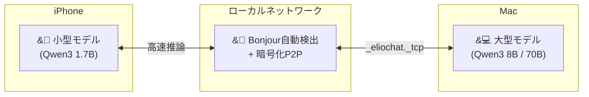

<p align="center">
  
</p>

<h1 align="center">ElioChat</h1>

<h3 align="center">あなたの秘密を守る、第2の脳。</h3>

<p align="center">
  完全無料 ・ 広告なし ・ オフライン動作 ・ データ送信ゼロ
</p>

<p align="center">
  <a href="https://apps.apple.com/app/elio-chat/id6757635481">
    
  </a>
  &nbsp;&nbsp;
  <a href="https://elio.love">
    
  </a>
</p>

<br>

<p align="center">
  
  &nbsp;
  
  &nbsp;
  
  &nbsp;
  
  &nbsp;
  
</p>

<p align="center">
  <strong>日本語</strong> ｜ <a href="README.en.md">English</a>
</p>

<br>

---

<br>

<p align="center">
  
  &nbsp;
  
  &nbsp;
  
  &nbsp;
  
  &nbsp;
  
</p>

<br>

---

<br>

## ElioChatでできること

<br>

<table>
<tr>
<td width="50%" valign="top">

### &#9992;&#65039; 機内モードでもAIと会話

インターネット不要。飛行機・地下鉄・山の中でも動きます。
すべての処理がiPhone上で完結し、データが外部に漏れることはありません。

> **あなた**: 今日の会議の議事録をまとめて
>
> **Elio**: 承知しました。以下の形式でまとめます：
> - 日時: 2月23日 14:00-15:00
> - 参加者: 田中、佐藤、山田
> - 議題: Q1売上報告...

</td>
<td width="50%" valign="top">

### &#128197; カレンダー・リマインダーをAIで操作

iOS標準のカレンダー・リマインダー・連絡先・写真と直接連携。
[MCP](https://modelcontextprotocol.io/) 対応 **世界初** のiOSアプリです。

> **あなた**: 今日の予定を教えて
>
> **Elio**: カレンダーを確認しました：
> - 10:00 チーム定例
> - 12:00 佐藤さんとランチ
> - 14:00 プロジェクトレビュー

</td>
</tr>
<tr>
<td width="50%" valign="top">

### &#127912; 写真をAIに見せて質問

カメラで撮影した写真やライブラリの画像をその場で分析。
Qwen3-VL / SmolVLM による画像認識AIを搭載。

> **あなた**: &#91;写真を添付&#93; これは何の花？
>
> **Elio**: これはソメイヨシノ（桜）です。
> 開花時期は3月下旬〜4月上旬で、日本を代表する花です。

</td>
<td width="50%" valign="top">

### &#127908; 音声で入力

WhisperKit によるオンデバイス音声認識。
日本語・英語対応。音声データも外部送信なし。

> **あなた**: &#91;マイクボタンを押して話す&#93;
>
> 「明日の朝9時に歯医者のリマインダー作って」
>
> **Elio**: リマインダーを作成しました：
> 歯医者 - 明日 9:00

</td>
</tr>
</table>

<br>

---

<br>

## &#128640; ChatGPTとの比較

<table>
<thead>
<tr>
<th align="left"></th>
<th align="center">ElioChat</th>
<th align="center">ChatGPT</th>
</tr>
</thead>
<tbody>
<tr><td><strong>&#128504; オフライン動作</strong></td><td align="center">機内モードOK</td><td align="center">ネット必須</td></tr>
<tr><td><strong>&#128274; データ送信</strong></td><td align="center">ゼロ</td><td align="center">クラウドに送信</td></tr>
<tr><td><strong>&#128065; AI学習に使用</strong></td><td align="center">されない</td><td align="center">される可能性あり</td></tr>
<tr><td><strong>&#127970; 企業利用</strong></td><td align="center">ChatGPT禁止企業でもOK</td><td align="center">規定による</td></tr>
<tr><td><strong>&#128190; 会話の保存先</strong></td><td align="center">端末内のみ</td><td align="center">サーバーに保存</td></tr>
<tr><td><strong>&#128279; MCP連携</strong></td><td align="center">13種類</td><td align="center">非対応</td></tr>
<tr><td><strong>&#128421; P2P推論</strong></td><td align="center">Mac連携可能</td><td align="center">非対応</td></tr>
<tr><td><strong>&#128176; 料金</strong></td><td align="center"><strong>完全無料</strong></td><td align="center">月額 $20</td></tr>
</tbody>
</table>

<br>

---

<br>

## &#129302; 30以上のAIモデルから選択

<table>
<tr>
<td width="33%" valign="top">

#### &#11088; おすすめ

| モデル | サイズ |
|--------|--------|
| Qwen3 0.6B | ~500MB |
| Qwen3 1.7B | ~1.2GB |
| Qwen3 4B | ~2.7GB |
| Qwen3 8B | ~5GB |
| Gemma 3 1B | ~700MB |
| Gemma 3 4B | ~2.5GB |
| Phi-4 Mini | ~2.4GB |

</td>
<td width="33%" valign="top">

#### &#127471;&#127477; 日本語特化

| モデル | サイズ |
|--------|--------|
| TinySwallow 1.5B | ~986MB |
| ELYZA Llama 3 8B | ~5.2GB |
| Swallow 8B | ~5.2GB |

> Sakana AI、東大松尾研、東工大 による日本語最適化モデル

</td>
<td width="33%" valign="top">

#### &#128248; 画像認識 (Vision)

| モデル | サイズ |
|--------|--------|
| Qwen3-VL 2B | ~1.1GB |
| Qwen3-VL 4B | ~2.5GB |
| Qwen3-VL 8B | ~5GB |
| SmolVLM 2B | ~1.1GB |

> 写真を添付するだけでAIが画像を分析

</td>
</tr>
</table>

### デバイス別おすすめ

```
iPhone 12 / 13        →  Qwen3 0.6B - 1.7B （軽量・高速）
iPhone 14 Pro 以降     →  Qwen3 4B, Gemma 3 4B （高性能）
iPhone 15/16 Pro Max  →  Qwen3 8B, ELYZA 8B （最高品質）
iPad (M1以降)          →  全モデル対応
```

<br>

---

<br>

## &#128279; MCP連携 ― AIがiOSの機能を操作

[Model Context Protocol](https://modelcontextprotocol.io/) でAIとiOSシステム機能をシームレスに連携：

<table>
<tr>
<td width="33%" valign="top">

**&#128197; カレンダー**
- 予定の確認・作成・削除
- 「今日の予定を教えて」

**&#128221; リマインダー**
- リマインダーの管理
- 「明日10時にゴミ出し」

</td>
<td width="33%" valign="top">

**&#128100; 連絡先**
- 連絡先の検索・表示
- 「鈴木さんの電話番号は？」

**&#128205; 位置情報**
- 現在地の取得
- 「今の場所はどこ？」

</td>
<td width="33%" valign="top">

**&#128247; 写真**
- ライブラリへのアクセス
- 画像をAIに送信して分析

**&#128269; Web検索**
- DuckDuckGo匿名検索
- 「最新のiPhone価格は？」

</td>
</tr>
</table>

<br>

---

<br>

## &#128421; P2P推論 ― iPhoneとMacが連携

重い推論処理をローカルネットワーク経由でMacにオフロード。データはLAN内のみで完結。



<table>
<tr>
<td width="50%" valign="top">

**&#128268; 接続方法**

1. Macでモデルをロード
2. Mac が `_eliochat._tcp` でアドバタイズ開始
3. iPhoneがBonjourでMacを自動発見
4. 4桁コードでセキュアにペアリング
5. 次回以降は自動接続

</td>
<td width="50%" valign="top">

**&#9889; チャットモード**

| モード | 説明 |
|--------|------|
| **Local** | 端末のみ（完全オフライン） |
| **Cloud** | ChatWeb API / Groq |
| **Private P2P** | Macの推論パワーを活用 |
| **P2P Mesh** | 複数デバイスで協調推論 |
| **Speculative** | ローカル下書き + Mac検証 |

</td>
</tr>
</table>

<br>

---

<br>

## &#128100; こんな人におすすめ

<table>
<tr>
<td align="center" width="20%">
<br>
<strong>&#127970;</strong>
<br><br>
<strong>企業の機密情報を<br>扱う人</strong>
<br>
<sub>ChatGPT禁止の<br>企業でもOK</sub>
<br><br>
</td>
<td align="center" width="20%">
<br>
<strong>&#9992;&#65039;</strong>
<br><br>
<strong>圏外環境で<br>AIを使いたい人</strong>
<br>
<sub>飛行機・地下鉄<br>山の中でも</sub>
<br><br>
</td>
<td align="center" width="20%">
<br>
<strong>&#128274;</strong>
<br><br>
<strong>プライバシーを<br>重視する人</strong>
<br>
<sub>データ送信ゼロ<br>端末内で完結</sub>
<br><br>
</td>
<td align="center" width="20%">
<br>
<strong>&#127471;&#127477;</strong>
<br><br>
<strong>日本語で<br>AIを使いたい人</strong>
<br>
<sub>日本語特化モデル<br>多数搭載</sub>
<br><br>
</td>
<td align="center" width="20%">
<br>
<strong>&#128197;</strong>
<br><br>
<strong>AIとカレンダーを<br>連携させたい人</strong>
<br>
<sub>MCP対応<br>13種類の連携</sub>
<br><br>
</td>
</tr>
</table>

<br>

---

<br>

<details>
<summary><h2>&#128736;&#65039; 開発者向け情報</h2></summary>

### ビルド

```bash
git clone https://github.com/yukihamada/elio.git
cd elio
open ElioChat.xcodeproj
```

1. Xcode で Signing & Capabilities を設定
2. 実機を接続して `Cmd+R`

### テスト

```bash
# 135件のユニットテスト
xcodebuild test -project ElioChat.xcodeproj -scheme ElioChat \
  -testPlan UnitTests -destination 'platform=iOS Simulator,name=iPhone 16'
```

### アーキテクチャ

```mermaid
graph TB
    subgraph Views["&#127912; Views (SwiftUI)"]
        V1[ChatView]
        V2[SettingsView]
        V3[PeerConnectionView]
    end

    subgraph App["&#128241; App Layer"]
        A1[AppState]
        A2[AppIntents / Siri]
    end

    subgraph Agent["&#129302; Agent"]
        AG1[AgentOrchestrator]
        AG2[ConversationManager]
        AG3[ToolParser]
    end

    subgraph ChatModes["&#128260; ChatModes"]
        CM[ChatModeManager]
        B1[LocalBackend]
        B2[CloudBackend]
        B3[P2PBackend]
        B4[SpeculativeBackend]
    end

    subgraph LLM["&#9881;&#65039; LLM Engine"]
        L1["ModelLoader<br>(30+ GGUF models)"]
        L2["CoreMLInference<br>(llama.cpp)"]
        L3["WhisperManager<br>(WhisperKit)"]
    end

    subgraph MCP["&#128279; MCP Servers"]
        M1["Calendar / Reminders"]
        M2["Contacts / Photos"]
        M3["Location / Web Search"]
    end

    subgraph P2P["&#128421; P2P Server"]
        P1[PrivateServerManager]
        P2[MeshP2PManager]
        P3["ProximityDiscovery<br>(Bonjour)"]
    end

    Views --> App --> Agent --> ChatModes
    ChatModes --> LLM
    Agent --> MCP
    ChatModes --> P2P
```



### ディレクトリ構造

```
LocalAIAgent/
├── App/            AppState, Siri Shortcuts
├── Agent/          AgentOrchestrator, ToolParser
├── LLM/            ModelLoader, CoreMLInference, WhisperKit
├── ChatModes/      ChatModeManager
│   ├── Backends/   Local, Cloud, P2P, Speculative
│   └── P2PServer/  PrivateServer, MeshP2P
├── Discovery/      Bonjour / QR Code
├── MCP/            13 MCP Servers
├── Security/       DeviceIdentity, Keychain
├── TokenEconomy/   Subscriptions, Tokens
├── Views/          SwiftUI
└── Resources/      Assets, Localization
```

### コントリビュート

プルリクエストを歓迎します！

1. フォーク → `git checkout -b feature/amazing-feature`
2. コミット → `git push origin feature/amazing-feature`
3. プルリクエストを作成

</details>

<br>

---

<br>

<p align="center">
  <a href="https://apps.apple.com/app/elio-chat/id6757635481">
    
  </a>
</p>

<p align="center">
  <a href="https://elio.love">公式サイト</a> ・
  <a href="https://elio.love/privacy">プライバシーポリシー</a> ・
  <a href="https://elio.love/terms">利用規約</a> ・
  <a href="LICENSE">MIT License</a>
</p>

<br>

<p align="center">

**謝辞**: [llama.cpp](https://github.com/ggerganov/llama.cpp) ・ [Model Context Protocol](https://modelcontextprotocol.io/) ・ [WhisperKit](https://github.com/argmaxinc/WhisperKit)

</p>

<p align="center">
  <sub>Made with love by <a href="https://github.com/yukihamada">yukihamada</a></sub>
</p>
